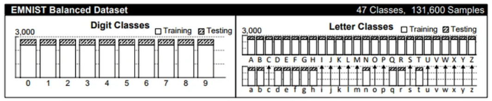
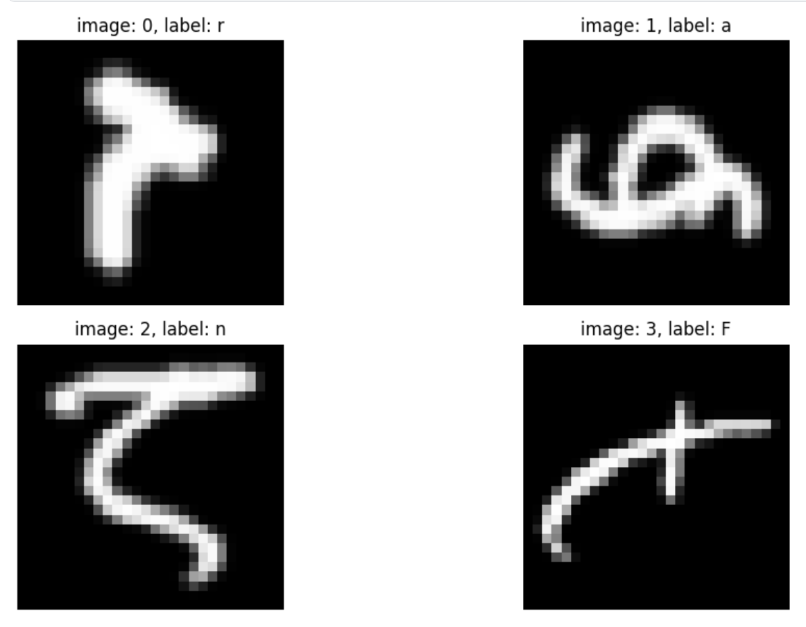
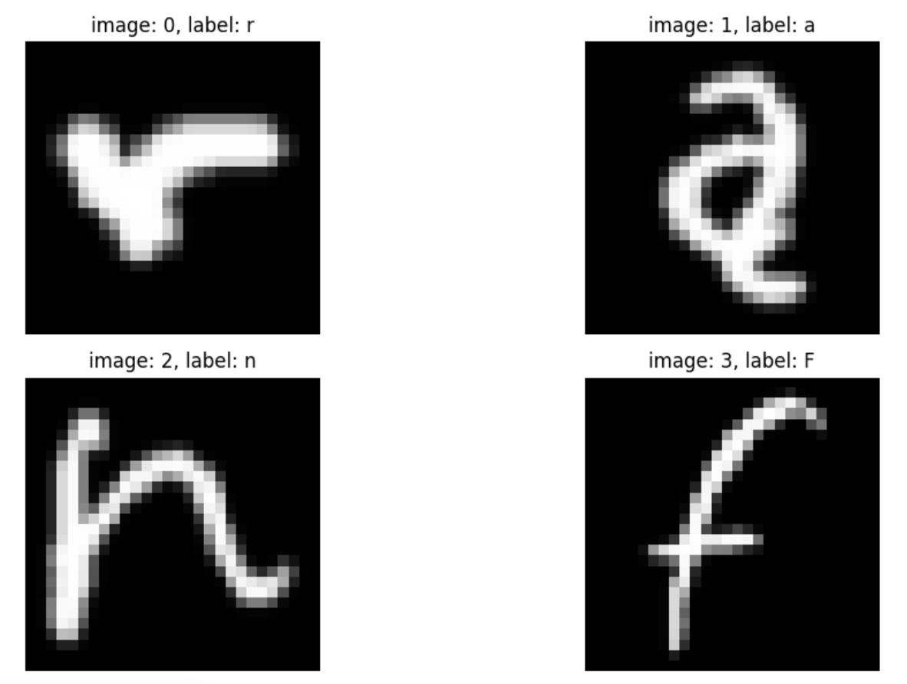
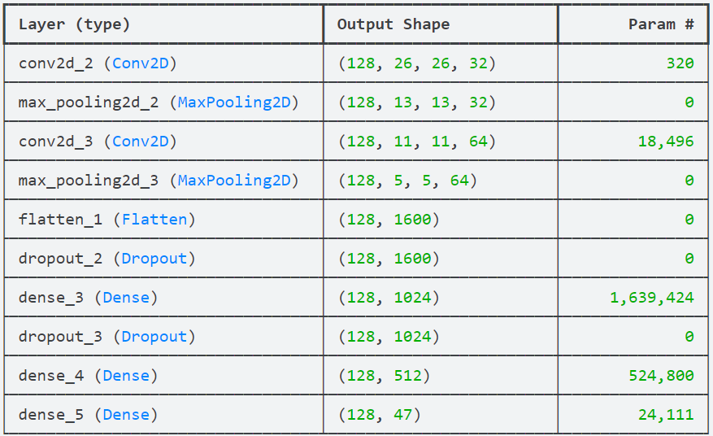
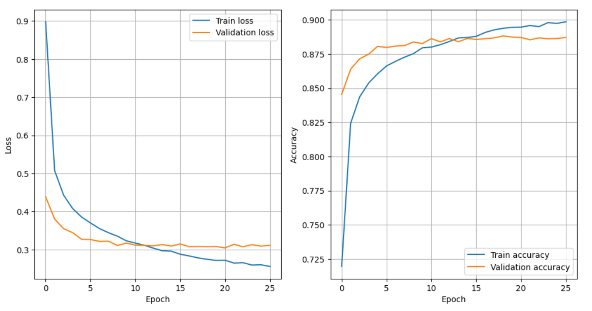

# CHI ML Internship 2024

## Introduction

The goal of the project is to design a neural network that can classify small, black-and-white images of handwritten characters. The characters can be both digits and letters.

## How to Use

To interact with the model, you need to perform as follows:

1. Run the following command from the project's root directory: `docker build -t <your-container-name> .`
2. Once the container was built, run the following commad: `docker run -it --rm <your-container-name> <your-folder-with-handwritten-characters>`

The output of the model is presented in the following format:
"[ascii value of the character], [name of the file]"

To run the model training script, execute: `docker run -it --rm --entrypoint python3 <your-container-name> train.py`

To manually interact with the container, run: `docker run -it --rm --entrypoint bash <your-container-name>`

## Methodology

### Dataset

The problem of recognizing handwritten characters is widely known and has been extensively covered in scientific literature. [EMNIST](https://paperswithcode.com/dataset/emnist) is a family of datasets which aim to address this issue. It provides several datasets of black-and-white images of handwritten digits and letters, which makes it suitable for the recognition of handwritten characters.

Extended MNIST contains a few datasets. The decision was made to use its [Balanced](https://paperswithcode.com/sota/image-classification-on-emnist-balanced) variation. It comprises 112800 records for training and 18800 records for testing.
<figure>
    
    <figcaption>Source: <a href="https://doi.org/10.48550/arXiv.1702.05373" target="_blank">arXiv:1702.05373</a>
    </figcaption>
</figure>

This version was selected for this project because, as the figure illustrates, it contains both digits and letters, has sufficiently many records to train a neural network, and because of what the authors of the EMNIST paper said about its applicability:
<blockquote>
"The EMNIST Balanced dataset is intended to be the most widely applicable dataset as it contains a balanced subset of all the By Merge classes."
</blockquote>

### Data Preprocessing

Upon the first investigation of the data, the following was observed:

The images were confusing. By simply looking at them, it was not possible to understand what label they corresponded to. This observation required further investigation, and it was discovered that the images needed to be mirrored and rotated 90° anticlockwise to appear in their correct orientation.

Additionaly, pixel values were scaled down to the range from 0 to 1 in order to speed up computations.

### Model Architecture

A CNN was created and trained to classify the handwritten characters. Its architecture looks as follows:

The architecture consists of 2 convolutional layers each followed by a pooling one, 2 fully-connected (FC) layers, and an output layer. Dropout layers with the rate of 0.5 were added for the FCs to prevent overfitting.

### Training Process

Training was done on the 112800 records in the test dataset. Ten percent of those were taken to create a validation dataset.

The model was configured to train for a maximum of 50 epochs in batches of 128 samples each, with early stopping implemented to prevent overfitting. Training automatically stopped after 26 epochs when the model's validation performance ceased to improve.

Categorical cross-entropy evaluated the loss, while the Adam optimizer adjusted the model's parameters.

## Results

The learning curves for training and validation phases are depicted below.

The validation loss dropped to nearly 0.3, while the accuracy reached approximately 88%.

The final assessment was made with the designated test dataset and the CNN achieved an accuracy of <b>89.19%<b>.

## Author

Mykyta Toropov\
[LinkedIn](www.linkedin.com/in/nikita-toropov)\
[GitHub](https://github.com/tossik8)\
[Kaggle](https://www.kaggle.com/tossik)
